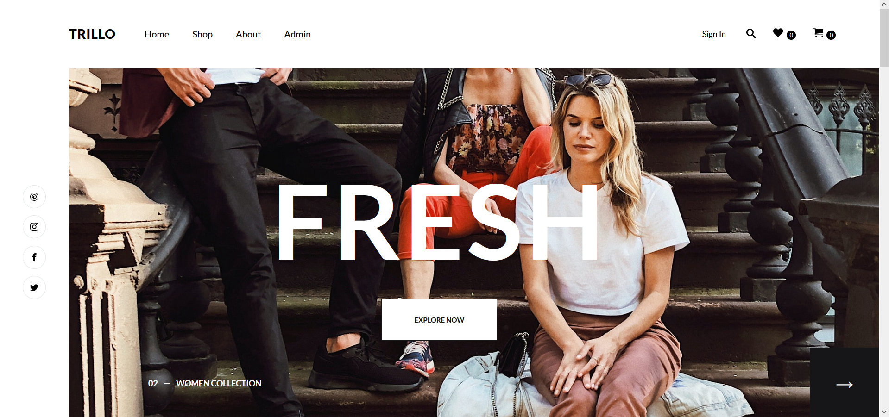
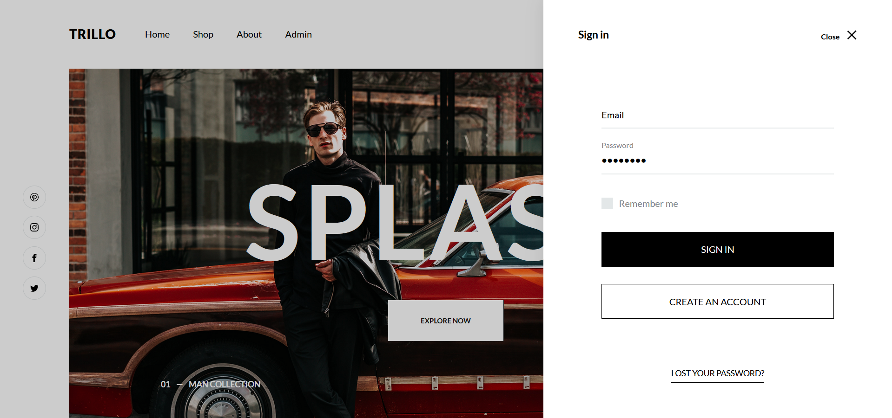
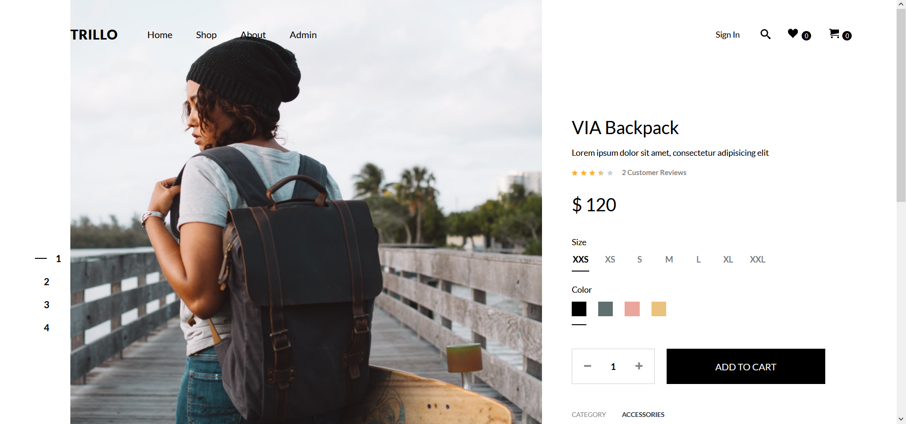

<h1 align="center">Trillo Shop Client</h1>

<p align="center">


</p>

## About The Project

_This is the client-side of the Trillo shop application. The project is under construction..._

<br/>

<p align="center">
  
</p>

<p align="center">
  
</p>

<p align="center">
  
</p>

## Features

- Login

## Built With

| Client                                                                                                                                                                                      
| ---------------------------------------------------------------------------------------------------------------- 
| [React](https://reactjs.org/) 
| [Redux](https://redux.js.org/introduction/getting-started)
| [Redux-Thunk](https://github.com/reduxjs/redux-thunk)
| [TypeScript](https://www.typescriptlang.org/)
| [Axios](https://github.com/axios/axios)
| [React Hook Form](https://react-hook-form.com/)
| [Sass](https://sass-lang.com/)

## Getting Started

### Prerequisites

-  Node.js

### Installation

1. **Navigate into your project directory and run the following command to download packages.**

```shell
npm install
```
      
2. **Start the development environment.**

```shell
npm start
```

Your site is now running at `http://localhost:3000`

## License

This project is licensed under the MIT License.

## Contact

**Krzysztof Talar** - [Linkedin](https://www.linkedin.com/in/ktalar/) - krzysztoftalar@protonmail.com
